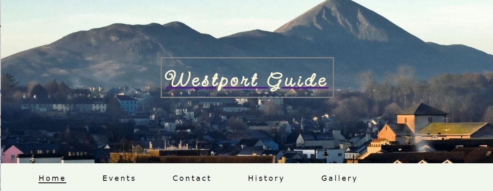
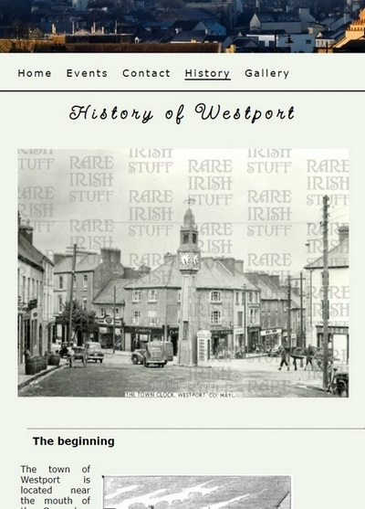
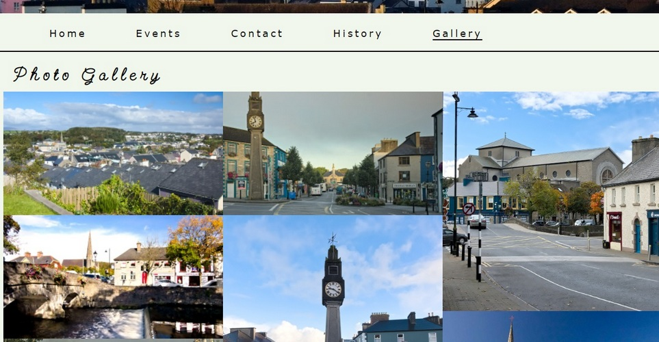
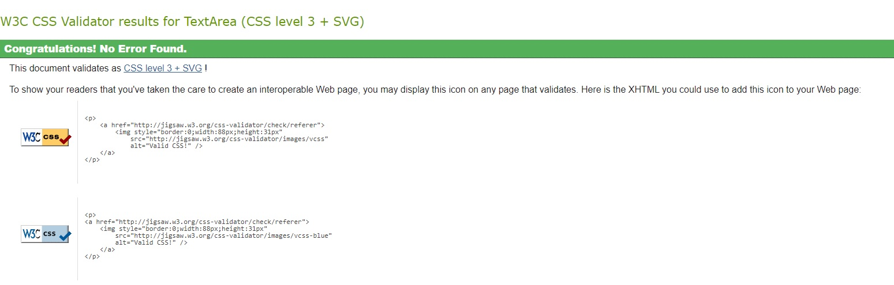

# Westport Travel Guide Webpage.

## Welcome to my page! 

This page was created for who are people searching for some information about the town of Westport located in County Mayo at the west coast of Ireland.
The page provides a brief, useful set of information such as location, population, contact, brief history of the town and a gallery of photos.

### **Features**
The page is made of five main sections devided into three subpages:
It is:
- **Home Page** that contain some general informations about the town and also two other subsections:
    * **Events** section presents list of events taking place in the town in the nearest future and it is suppose to be updated as often as it's possible.

    * **Contact** section and the map with pointed the locations of Westport. It also contains the address of the Town Hall, contact phone number and email address.
    The user also can post a question to the towns information center.

- **History Page** that contain a brief history of the town and a few photos presenting historical views of the town. 
The acticle on the history originally comes from MyIreland Page and you can find it by clicking in this link: https://www.mayo-ireland.ie/en/towns-villages/westport/history/foundation-of-westport.html 

- **Gallery Page** contains a collection of photos showing contemporary views of the town. All photos are taken by the author of this webside and are protected by copyrights.

All sections are clearly and simply arranged inside the navigation bar which allows for an easy access to each of them. 

- **Footer.** - The last section is Footer that contain information about copyrights and links to the social media such as Facebook, Twitter and Instagram.

### *Validator Testing*
- HTML
    * No errors were detected when passing through the [W3C validator](https://validator.w3.org/nu/).
- CSS
    * No errors were detected when passing through the [jigsaw.w3 validator](https://jigsaw.w3.org/css-validator)
    

