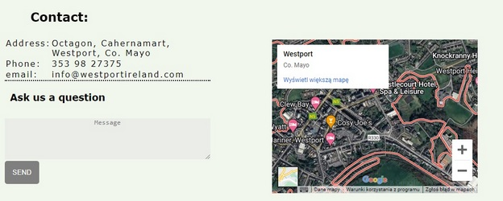

# Westport Travel Guide Webpage.

## Welcome to my page! 

This page was created to provide a bunch of information about the town of Westport located in County Mayo at the west coast of Ireland in short and easy way.
The page provides a brief and useful set of information such as location, population, contact, brief history of the town and a gallery of photos.

## Feature
The page includes five sections devided into three subpages:
It is as follows:
- **Home Page** that contain some general informations about the town. This section also contains two other subsections:
    * **Events** section presents list of events taking place in the town in the nearest future and it is suppose to be updated as often as it's possible.

    * **Contact** section and the map with pointed the locations of Westport. It also contains the address of the Town Hall, contact phone number and email address.
    The user also can post a question to the towns information center. This section needs some updates, such as applying a specific address for posting the massage to. Temporarily an attempt to send a message effects being redirected back to the Home Page. 

      Clicking the Send button will result with being redirected to the home page as you can se on the pictures below:

      
      

      Future feature for this section would be creating a diagram that would collect the user e-mail address for feetback.

    

- **History Page** that contain a brief history of the town and a few photos presenting historical views of the town. 
The acticle on the history originally comes from MyIreland Page and you can find it by clicking in this link: https://www.mayo-ireland.ie/en/towns-villages/westport/history/foundation-of-westport.html 

  
- **Gallery Page** contains a collection of photos showing contemporary views of the town. All photos are taken by the author of this webside and are protected by copyrights.

  

All sections are clearly and simply arranged inside the navigation bar which allows for an easy access to each of them. 

- **Footer.** - The last section is Footer that contain information about copyrights and links to the social media such as Facebook, Twitter and Instagram.

  

## Technologies used:
  - HTML5
  - CSS3
  - Gitpod
  - GitHub

## Testing
Every page in this project was validation tested and it is responsive for every type of devices from desktop computers to mobile phone screen.
More details about tesings are available in the separate testing section [here](documentation/TESTING.md).
Or in the dedicated directory documentation/TESTING.md

## Deployment

The site was deployed to GitHub pages. The steps to deploy are as follows: 
  - In the [GitHub repository](https://github.com/TomaszWoloszyn983/westport-travel-guide), navigate to the Settings tab 
  - From the source section drop-down menu, select the **Main** Branch, then click "Save".
  - The page will be automatically refreshed with a detailed ribbon display to indicate the successful deployment.

The live link can be found [here](https://tomaszwoloszyn983.github.io/westport-travel-guide)

### Local Deployment

In order to make a local copy of this project, you can clone it. In your IDE Terminal, type the following command to clone my repository:

- `git clone https://github.com/TomaszWoloszyn983/westport-travel-guide.git`

Alternatively, if using Gitpod, you can click below to create your own workspace using this repository.

## Credits

All images and articles that are used in this project serve educational purposes only and will not be used for any commercial use.
- The article on the history of the town of Westport comes from Mayo-ireland.ie and it is available on this link:
    https://www.mayo-ireland.ie/en/towns-villages/westport/history/foundation-of-westport.html
- Also historical photos of Westport were taken from:
     https://scontent-dub4-1.xx.fbcdn.net/v/t1.6435-9/125513691_3768247179886864_1059465307910225672_n.jpg?_nc_cat=109&ccb=1-5&_nc_sid=825194&_nc_ohc=3-eaXxE-H1YAX8A0XxK&_nc_ht=scontent-dub4-1.xx&oh=00_AT82hMQp8MZIAvJqimRiJf6OcE6ElAFPk8SotkjlSJP12w&oe=6290DDF5
     https://i.pinimg.com/originals/1f/d3/86/1fd386fe62235aa22f8449d736361d8a.jpg
     https://www.westporthouse.ie/wp-content/uploads/2020/09/1915.jpg
- Informations and the Coat Of Arms picture comes from Westport wikipedia page.
     https://en.wikipedia.org/wiki/Westport,_County_Mayo#History
     https://en.wikipedia.org/wiki/Westport,_County_Mayo#/media/File:Westport_Coat_of_Arms.png
- Also some informations about news and events taking place in Westport were taken from destinationwesport site.
     https://www.destinationwestport.com

